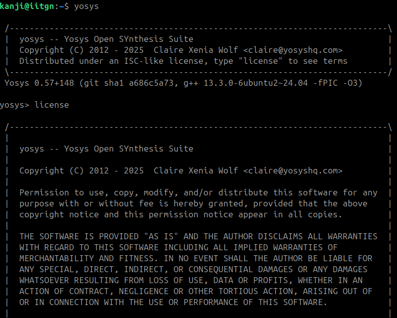
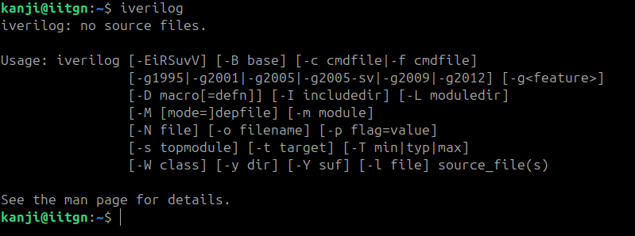
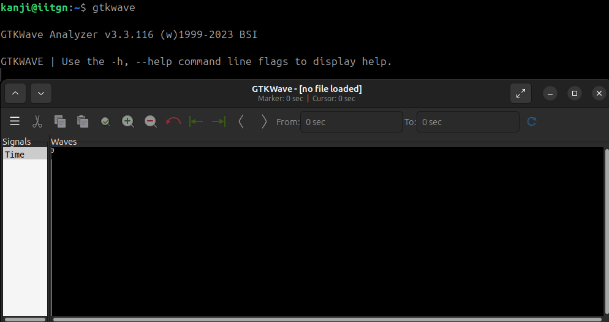
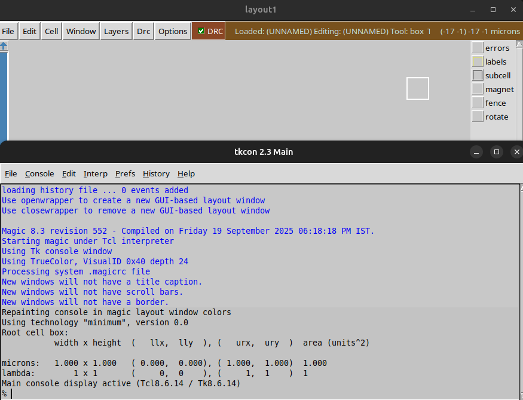

<p align="center">
  
</p>

<p align="center">
  
  
  
</p>

<p align="center">
This is my playground + notebook + lab report (RISC-V Reference SoC Tapeout diary), all rolled into one.  
</p>

<p align="center">
  
</p>

---

# 📅 Week 0 – Tools Installation & Environment Setup 

<details>
<summary>Installation Flow</summary>
🔹 Yosys – Logic Synthesis Tool

Yosys is an open-source synthesis framework used to convert Verilog RTL into gate-level netlists. It’s the backbone of open-source digital design flows and works with standard cell libraries like Sky130.

```bash
sudo apt-get update
git clone https://github.com/YosysHQ/yosys.git
cd yosys
sudo apt install make build-essential clang bison flex \
    libreadline-dev gawk tcl-dev libffi-dev git \
    graphviz xdot pkg-config python3 libboost-system-dev \
    libboost-python-dev libboost-filesystem-dev zlib1g-dev
make config-gcc
make
sudo make install
```
<p align="center">
  
</p>

🔹 Icarus Verilog (iverilog) – RTL Simulation

Icarus Verilog is a Verilog simulator that lets you compile and run HDL code, often paired with GTKWave for waveform viewing.

```bash
sudo apt-get update
sudo apt-get install iverilog
```
<p align="center">
  
</p>

🔹 GTKWave – Waveform Viewer

GTKWave is a signal waveform viewer used to visualize VCD/EVCD files generated during simulation.

```bash
sudo apt-get update
sudo apt-get install gtkwave
```
<p align="center">
  
</p>
🔹 Ngspice – Circuit Simulator

Ngspice is an analog/mixed-signal circuit simulator, widely used for SPICE netlists, device models, and transistor-level verification.

```bash
# Download ngspice (ngspice-xx.tar.gz) from SourceForge

tar -xvzf ngspice-xx.tar.gz
cd ngspice-xx
mkdir release && cd release
../configure --with-x --with-readline=yes --disable-debug
make
sudo make install

```
<p align="center">
  
</p>

🔹 Magic VLSI – Layout Editor

Magic is a classic VLSI layout editor and DRC tool, used for viewing, editing, and validating IC layouts.

```bash
sudo apt-get install m4 tcsh csh libx11-dev tcl-dev tk-dev \
    libcairo2-dev mesa-common-dev libglu1-mesa-dev libncurses-dev
git clone https://github.com/RTimothyEdwards/magic
cd magic
./configure
make
sudo make install
```
<p align="center">
  
</p>

🔹 OpenLane – RTL to GDSII Flow

OpenLane is a fully automated digital design flow (built on OpenROAD + Yosys + Magic + KLayout) that takes RTL → GDSII. It’s the main open-source toolchain for tapeouts.

```bash
sudo apt-get update && sudo apt-get upgrade -y
sudo apt install -y build-essential python3 python3-venv python3-pip make git \
    apt-transport-https ca-certificates curl software-properties-common

# Install Docker
curl -fsSL https://download.docker.com/linux/ubuntu/gpg | \
  sudo gpg --dearmor -o /usr/share/keyrings/docker-archive-keyring.gpg

echo "deb [arch=amd64 signed-by=/usr/share/keyrings/docker-archive-keyring.gpg] \
https://download.docker.com/linux/ubuntu $(lsb_release -cs) stable" | \
  sudo tee /etc/apt/sources.list.d/docker.list > /dev/null

sudo apt update
sudo apt install docker-ce docker-ce-cli containerd.io

# Test Docker
sudo docker run hello-world

# Add user to docker group
sudo groupadd docker
sudo usermod -aG docker $USER
sudo reboot

# After reboot
docker run hello-world

# Install OpenLane
cd $HOME
git clone https://github.com/The-OpenROAD-Project/OpenLane
cd OpenLane
make
make test
```
A successful run of the `spm` design using **Sky130A PDK**.  
Key outputs are stored under [`Week-0/assets/openlane-spm/final/`](Week-0/assets/openlane-spm/final/).

- [Metrics Report](Week-0/assets/openlane-spm/final/metrics.csv)
- [Final GDSII (Magic)](Week-0/assets/openlane-spm/final/gds/spm.gds)
- [Final LEF](Week-0/assets/openlane-spm/final/lef/spm.lef)
- [Final Verilog](Week-0/assets/openlane-spm/final/verilog/spm.v)
</details>

---
