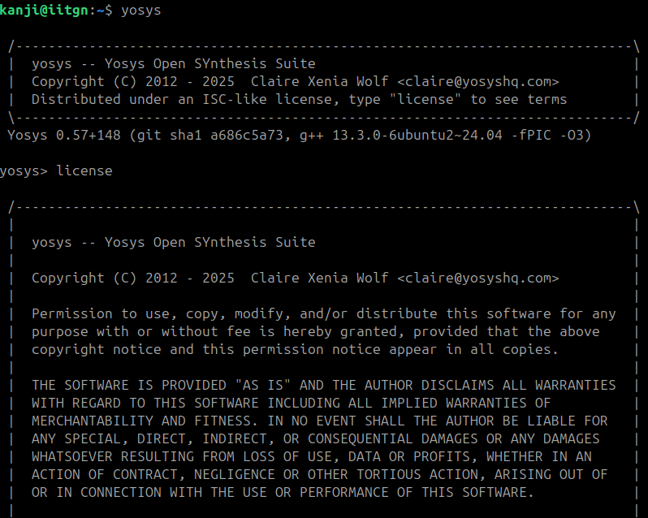
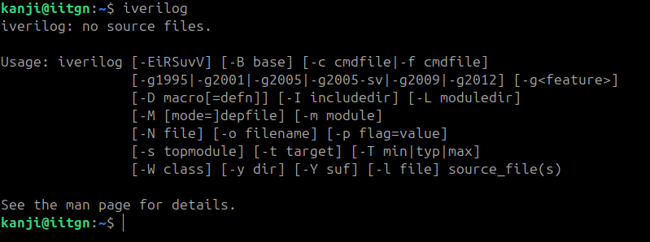
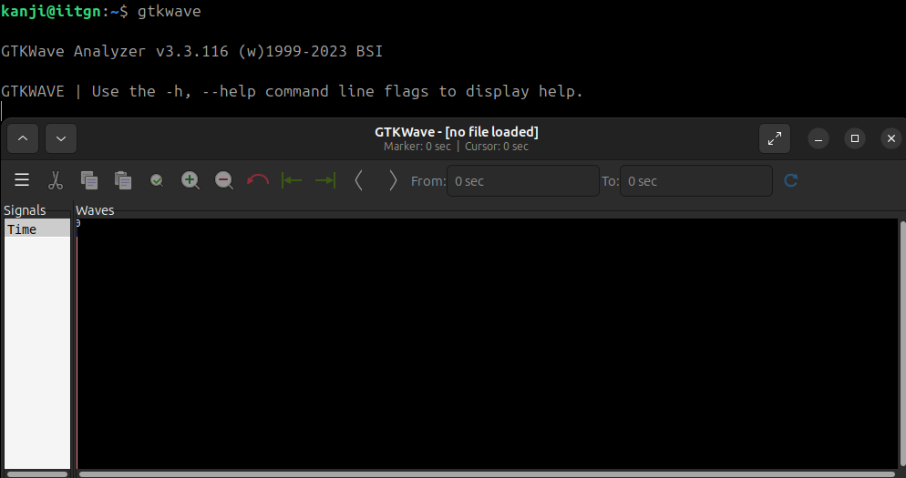
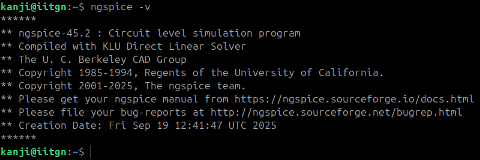
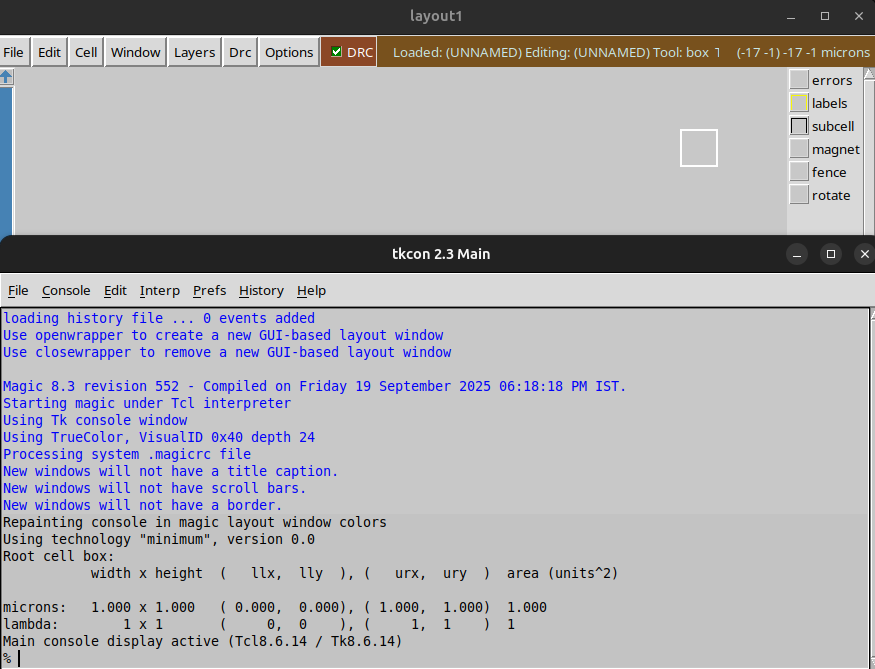
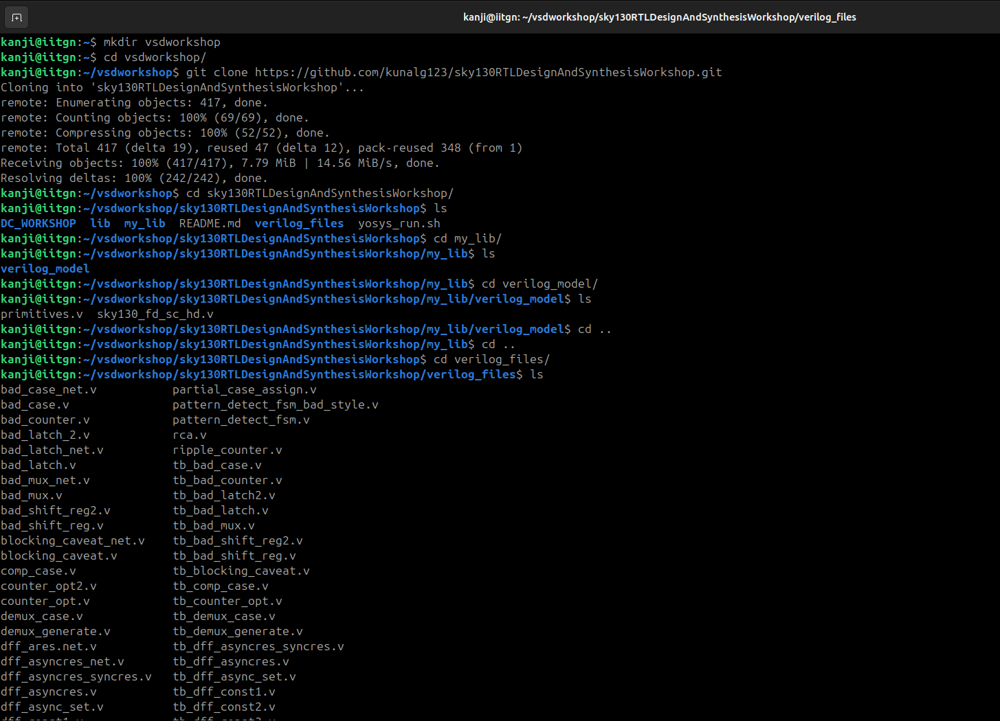
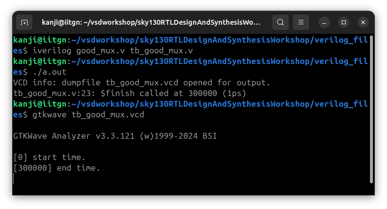
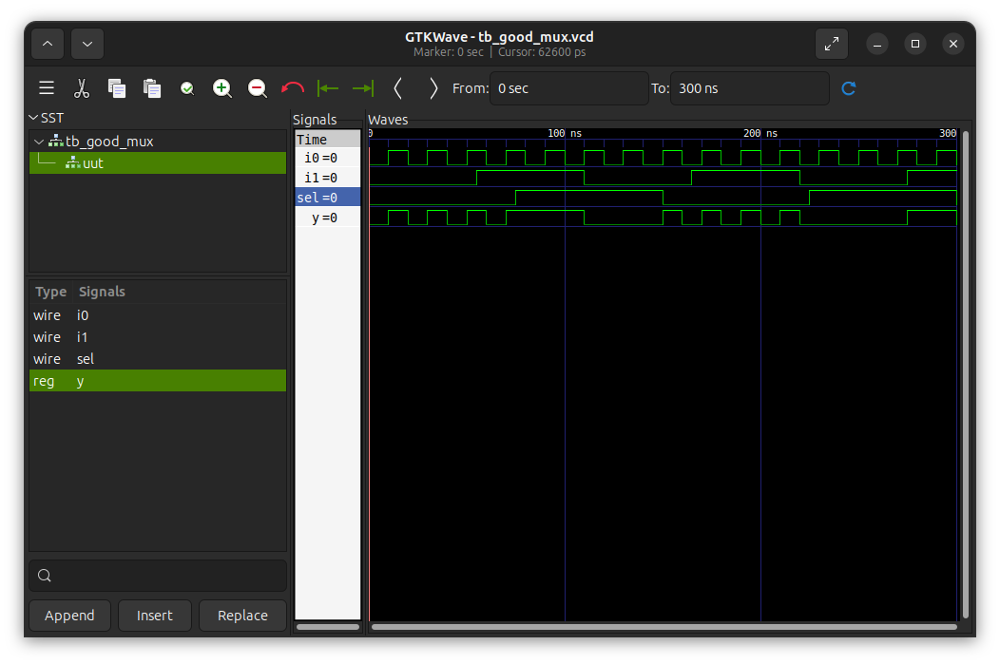
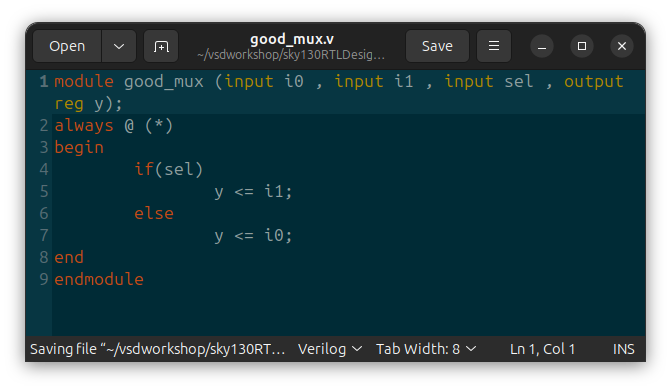
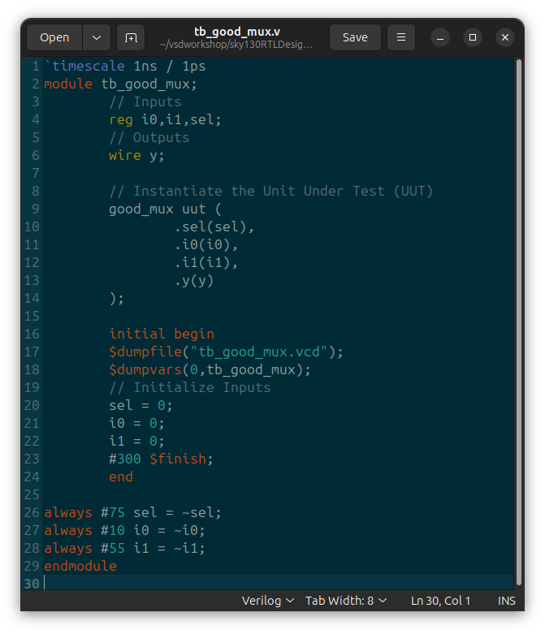

<p align="center">
  
</p>

<p align="center">
  
  
  
</p>

<p align="center">
It’s not just a repo of code and configs, but a playground for <b> experiments, notes, logs, and artifacts .</b> <br> <i>📖 Documenting the process in an open, transparent, and reproducible way.</i>
</p>

<p align="center">
  
</p>

---
<details>
<summary> Tools Installation & Environment Setup </summary>
  <hr style="border-top: 1px dotted #bbb;" />
🔹 Yosys – Logic Synthesis Tool
  
An open-source synthesis framework used to convert Verilog RTL into gate-level netlists. It’s the backbone of open-source digital design flows and works with standard cell libraries like Sky130.

```bash
sudo apt-get update
git clone https://github.com/YosysHQ/yosys.git
cd yosys
sudo apt install make build-essential clang bison flex \
    libreadline-dev gawk tcl-dev libffi-dev git \
    graphviz xdot pkg-config python3 libboost-system-dev \
    libboost-python-dev libboost-filesystem-dev zlib1g-dev
make config-gcc
make
sudo make install
```
<p align="center">
  
</p>

<hr style="border-top: 1px dotted #bbb;" />

🔹 Icarus Verilog (iverilog) – RTL Simulation

Icarus Verilog is a Verilog simulator that lets you compile and run HDL code, often paired with GTKWave for waveform viewing.

```bash
sudo apt-get update
sudo apt-get install iverilog
```
<p align="center">
  
</p>

<hr style="border-top: 1px dotted #bbb;" />

🔹 GTKWave – Waveform Viewer

GTKWave is a signal waveform viewer used to visualize VCD/EVCD files generated during simulation.

```bash
sudo apt-get update
sudo apt-get install gtkwave
```
<p align="center">
  
</p>
<hr style="border-top: 1px dotted #bbb;" />

🔹 Ngspice – Circuit Simulator

Ngspice is an analog/mixed-signal circuit simulator, widely used for SPICE netlists, device models, and transistor-level verification.

```bash
# Download ngspice (ngspice-xx.tar.gz) from SourceForge

tar -xvzf ngspice-xx.tar.gz
cd ngspice-xx
mkdir release && cd release
../configure --with-x --with-readline=yes --disable-debug
make
sudo make install

```
<p align="center">
  
</p>
<hr style="border-top: 1px dotted #bbb;" />

🔹 Magic VLSI – Layout Editor

Magic is a classic VLSI layout editor and DRC tool, used for viewing, editing, and validating IC layouts.

```bash
sudo apt-get install m4 tcsh csh libx11-dev tcl-dev tk-dev \
    libcairo2-dev mesa-common-dev libglu1-mesa-dev libncurses-dev
git clone https://github.com/RTimothyEdwards/magic
cd magic
./configure
make
sudo make install
```
<p align="center">
  
</p>
<hr style="border-top: 1px dotted #bbb;" />

🔹 OpenLane – RTL to GDSII Flow

OpenLane is a fully automated digital design flow (built on OpenROAD + Yosys + Magic + KLayout) that takes RTL → GDSII. It’s the main open-source toolchain for tapeouts.

```bash
sudo apt-get update && sudo apt-get upgrade -y
sudo apt install -y build-essential python3 python3-venv python3-pip make git \
    apt-transport-https ca-certificates curl software-properties-common

# Install Docker
curl -fsSL https://download.docker.com/linux/ubuntu/gpg | \
  sudo gpg --dearmor -o /usr/share/keyrings/docker-archive-keyring.gpg

echo "deb [arch=amd64 signed-by=/usr/share/keyrings/docker-archive-keyring.gpg] \
https://download.docker.com/linux/ubuntu $(lsb_release -cs) stable" | \
  sudo tee /etc/apt/sources.list.d/docker.list > /dev/null

sudo apt update
sudo apt install docker-ce docker-ce-cli containerd.io

# Test Docker
sudo docker run hello-world

# Add user to docker group
sudo groupadd docker
sudo usermod -aG docker $USER
sudo reboot

# After reboot
docker run hello-world

# Install OpenLane
cd $HOME
git clone https://github.com/The-OpenROAD-Project/OpenLane
cd OpenLane
make
make test
```
A successful run of the `spm` design using **Sky130A PDK**.  
Key outputs are stored under [`Tools_installation/assets/openlane-spm/`](Tools_installation/assets/openlane-spm/).

- [Final GDSII (Magic)](Tools_installation/assets/openlane-spm/gds/spm.gds)
- [Final LEF](Tools_installation/assets/openlane-spm/lef/spm.lef)
- [Final Verilog](Tools_installation/assets/openlane-spm/verilog/gl/spm.v)
</details>

---
## <font color=""> 𝐖𝐞𝐞𝐤 𝟏</font>
<details>
<summary> <font color="#00f7ffff">Day 1-Introduction to Verilog RTL design and Synthesis </font></summary>
 <details>
  <summary> <font color="skyblue">Introduction to open-source simulator iverilog </font></summary>

  ### 2-SKY130RTL D1SK1 L1 Introduction to iverilog design test bench

  #### 🔹 Simulator
  A **simulator** is a software tool that mimics how an RTL design behaves over time without fabricating hardware.  
  - Inputs: Design (DUT) + Testbench  
  - Processes: Compiles and executes the RTL  
  - Outputs: Logs, reports, and waveform files (showing how signals evolve)  

  *Example:* iverilog compiles the RTL, and vvp executes it, generating a `.vcd` file viewable in GTKWave.  

  ---

  #### 🔹 Design (DUT)
  The **design** is the RTL description of the hardware circuit, written in Verilog, VHDL, or SystemVerilog.  
  - Defines structure and functionality.  
  - Synthesizable into gates and layout.  

  Example:  
  ```verilog
  module and_gate(input a, input b, output y);
      assign y = a & b;
  endmodule
  ```
  ---

  #### 🔹 Testbench

  A testbench is a non-synthesizable RTL environment used to verify the design.

  Generates stimulus signals.
  Monitors outputs.
  Dumps activity for waveform analysis.

  Example:
  ```verilog
  module and_gate_tb;
      reg a, b;
      wire y;

      and_gate dut (.a(a), .b(b), .y(y));

      initial begin
          $dumpfile("and_gate.vcd");
          $dumpvars(0, and_gate_tb);

          a=0; b=0; #10;
          a=0; b=1; #10;
          a=1; b=0; #10;
          a=1; b=1; #10;

          $finish;
      end
  endmodule

  ```
  ---
 #### 🔹 General Simulation Flow

  ```
+----------------+        +-----------+        +-----------------------------+
|  Design (RTL)  | -----> | Simulator | -----> | Logs / Waveforms / Coverage |
+----------------+        +-----------+        +-----------------------------+
           ^
           |
+----------------+
|   Testbench    |
+----------------+
  ```
  ---
####  🔹 Testbench Block Diagram

  ```
 +--------------------- Testbench ----------------------+
|                                                      |
|  +--------------------+       +-------------------+  |
|  | Stimulus Generator | ----> |   Design (DUT)    |  |
|  +--------------------+       +-------------------+  |
|                                   |                  |
|                                   v                  |
|                        +-------------------------+   |
|                        |     Stimulus Observer   |   |
|                        +-------------------------+   |
|                                                      |
+------------------------------------------------------+
  ```
  ---
####  🔹 Iverilog + GTKWave Simulation Flow

  ```
+------------+       +----------+       +-----------+       +---------+
|  RTL (v)   | ----> | iverilog | ----> |  vvp run  | --->  |  VCD    |
+------------+       +----------+       +-----------+       +---------+
       ^                                                       |
       |                                                       v
+------------+                                            +---------+
| Testbench  |------------------------------------------> | GTKWave |
+------------+                                            +---------+

  ```
  ---
####  🔹 Example Workflow with Open-Source Tools
  ```bash
  # Step 1: Compile design + testbench
  iverilog -o sim.out design.v testbench.v

  # Step 2: Run simulation
  vvp sim.out

  # Step 3: View waveforms
  gtkwave design.vcd

  ```
</details>
<details>
  <summary><font color="skyblue">Labs using iverilog and gtkwave</font></summary>
  <details>
    <summary><font color="#b69b72">Introduction to lab</font></summary>

###  Sky130 RTL Design and Synthesis Workshop (Working Repo)

This repository is a **working clone** of the  **[Sky130 RTL Design and Synthesis Workshop](https://github.com/kunalg123/sky130RTLDesignAndSynthesisWorkshop)**  
by [Kunal Ghosh](https://github.com/kunalg123).  

## 📂 Steps to Setup

#### 1️⃣ Create a workspace directory
```bash
mkdir vsdworkshop
cd vsdworkshop
```
#### 2️⃣ Clone the workshop repo
```bash
git clone https://github.com/kunalg123/sky130RTLDesignAndSynthesisWorkshop.git
```
This creates a folder:
```bash
sky130RTLDesignAndSynthesisWorkshop/
```
#### 3️⃣ Explore the repo structure
```bash
cd sky130RTLDesignAndSynthesisWorkshop/
ls
```
```bash
lib/    my_lib/    README.md    verilog_files/    yosys_run.sh
```
<p align="center">

</p>
</details>

<details>
    <summary><font color="#b69b72">Introduction iverilog gtkwave part1</font></summary>
    
### Verilog Simulation of MUX (Sky130 Workshop)


### 📂 Files Used
- **Design File:** `good_mux.v`  
- **Testbench:** `tb_good_mux.v`  
- **Generated Output:** `tb_good_mux.vcd`  

---

### ⚙️ Steps to Run
<p align="center">

</p>

#### 1️⃣ Compile Design + Testbench
```bash
iverilog good_mux.v tb_good_mux.v
```
#### 2️⃣ Run Simulation
```bash
./a.out
```
Output:
```bash
VCD info: dumpfile tb_good_mux.vcd opened for output.
tb_good_mux.v:23: $finish called at 300000 (1ps)
```
#### 3️⃣ Open Waveform in GTKWave
```bash
gtkwave tb_good_mux.vcd
```
<p align="center">

</p>
i0 → Input 0 of the MUX (wire) |
i1 → Input 1 of the MUX (wire) |
sel → Select line (wire)       |
y → Output of the MUX (reg)    |

### Multiplexer Truth Table

For a 2:1 multiplexer:

| sel | y  |
| --- | -- |
| 0   | i0 |
| 1   | i1 |

## Waveform Explanation (0 → 300 ns)

| Time Range (approx) | sel | Output Behavior (y) | Explanation |
|---------------------|-----|---------------------|-------------|
| 0 – 100 ns          | 0   | y = i0              | When `sel=0`, output follows input `i0`. |
| 100 – 200 ns        | 1   | y = i1              | When `sel=1`, output follows input `i1`. |
| 200 – 300 ns        | 0   | y = i0              | `sel` switches back to 0, so output follows `i0` again. |

✅ This confirms that the **good_mux** design is functioning correctly.  

</details>

<details>
    <summary><font color="#b69b72">Introduction iverilog gtkwave part2</font></summary>

To view or edit the design files:
```bash
<Location of the verilog_files>
gedit good_mux.v
gedit tb_good_mux.v
```
<p align="center">

</p>

| Aspect        | Details                                                                 |
|---------------|-------------------------------------------------------------------------|
| **Inputs**    | `i0`, `i1` (data), `sel` (select line)                                  |
| **Output**    | `y` → declared as **reg** (since assigned inside an `always` block)     |
| **Logic**     | - If `sel = 1` → `y = i1` <br> - If `sel = 0` → `y = i0`                 |
| **Coding Style** | - Uses `always @(*)` → proper combinational block <br> - No latches inferred |

<p align="center">

</p>

| Aspect              | Details                                                                 |
|---------------------|-------------------------------------------------------------------------|
| **Simulation time** | Runs for **300 ns**, then finishes (`#300 $finish;`)                    |
| **Stimulus (sel)**  | Toggles every **75 ns** → switches output between `i0` and `i1`         |
| **Stimulus (i0)**   | Toggles every **10 ns** → fastest changing input                        |
| **Stimulus (i1)**   | Toggles every **55 ns** → medium speed input                            |
| **Waveform dump**   | Dumps to file **`tb_good_mux.vcd`**, can be viewed in **GTKWave**       |

</details>

</details>
<details>
  <summary><font color="skyblue">Introduction to Yosys and Logic synthesis</font></summary>

  <details>
    <summary><font color="#b69b72">Introduction to yosys</font></summary>
 
  ### 1️⃣ Synthesizer

  - Tool used for converting RTL to netlist  
  - **Yosys** is the synthesizer used in this course

```
+---------+            +-----------+            +-------------+
| DESIGN  | ---------> |           | ---------> |  netlist.v  |
+---------+            |   Yosys   |            +-------------+
|  .lib   | ---------> |           |
+---------+            +-----------+

```
 ### 2️⃣ Yosys Setup

- **read_verilog** → load the RTL design  
- **read_liberty** → load the standard cell library (.lib)  
- **write_verilog** → export synthesized netlist

```
   [read_verilog]                               [write_verilog]
        |                                             ^
        v                                             |
+---------+            +-----------+            +-------------+
| DESIGN  | ---------> |           | ---------> |  netlist.v  |
+---------+            |   Yosys   |            +-------------+
|  .lib   | ---------> |           |
+---------+            +-----------+
        ^
        |
  [read_liberty]

```
### 3️⃣ Verify the Synthesis

- After synthesis, the generated **netlist** is simulated with the same **testbench**.  
- **Icarus Verilog (iverilog)** compiles the design and produces a **VCD file**.  
- **GTKWave** is used to visualize the waveforms.

```
+-----------+            +-----------+            +-----------+
|  NETLIST  | ---------> |           | ---------> |  vcd file |
+-----------+            | iverilog  |            +-----------+
| Testbench | ---------> |           |
+-----------+            +-----------+
                               |
                               v
                         +-----------+
                         |  GTKWave  |
                         +-----------+

```
  </details>

  <details>
    <summary><font color="#b69b72">Introduction to logic synthesis part1</font></summary>

  ### 1️⃣ Synthesis

- **Synthesis** = process of converting **RTL (Register Transfer Level)** code into a **gate-level netlist**.  
- Input:
  - **RTL** (written in Verilog/VHDL)
  - **.lib file** (standard cell library, with logic gate definitions and timing)
- Output:
  - **Netlist** = a file describing the circuit as interconnected logic gates.
```
   +---------+            +-------------+            +-----------+
   |   RTL   | ---------> |             | ---------> |  Netlist  |
   | (Design)|            |  Synthesis  |            |  (Gates)  |
   +---------+            |   Tool      |            +-----------+
   +---------+            |  (Yosys)    |
   |  .lib   | ---------> |             |
   +---------+            +-------------+

```

👉 The netlist describes which gates are used (from the library) and how they are connected to realize the RTL functionality.

### 2️⃣ What is `.lib` ?

A **`.lib` (library) file** contains information about the **standard cells** available in a technology node.  
- It is essentially a **collection of logic gates** (AND, OR, NOT, NAND, etc.).  
- Provides:
  - **Functional behavior** of each gate
  - **Timing information** (delay, setup/hold, etc.)
  - **Power consumption**
  - **Different flavors** of the same gate (e.g., slow, medium, fast)  

#### Example contents of `.lib`:
- 2-input AND gate → slow / medium / fast  
- 3-input AND gate → slow / medium / fast  
- 4-input AND gate → multiple drive strengths

```
   +---------------------------------------------------+
   |                      .lib                         |
   |---------------------------------------------------|
   |  AND2  (slow)    AND2  (medium)    AND2  (fast)   |
   |  OR2   (slow)    OR2   (medium)    OR2   (fast)   |
   |  NAND3 (slow)    NAND3 (medium)    NAND3 (fast)   |
   |  NOR4  (slow)    NOR4  (medium)    NOR4  (fast)   |
   |                                                   |
   |   ... many more cells (XOR, INV, DFF, etc.) ...   |
   +---------------------------------------------------+

```
👉 The synthesis tool uses this `.lib` to **map RTL operators** into real hardware gates.

### 3️⃣ Why Different Flavors of Gates?

Not all gates are created equal.  
- In digital circuits, the **speed of operation** depends on **combinational delay**.  
- A clock cycle must be large enough to cover:
```
Tclk ≥ Tcq_A + Tcombi + Tsetup_B

where:
- `Tcq_A` = clock-to-Q delay of flip-flop A  
- `Tcombi` = delay of combinational logic  
- `Tsetup_B` = setup time of flip-flop B  

- The **maximum clock frequency** is:
   fclk_max = 1 / Tmin_clk
```
```
   +---------+         +-------------+         +---------+
   |  DFF A  | ------> |   COMBIN.   | ------> |  DFF B  |
   +---------+         |    Logic    |         +---------+
                       +-------------+

   <-------------------- One Clock Cycle -------------------->
```
#### Why flavors?  
- Faster cells reduce `Tcombi`, allowing higher clock frequency.  
- But **faster cells consume more power and area**.  
- Hence `.lib` provides multiple options:
  - **Slow cells** → lower power, but higher delay  
  - **Fast cells** → higher speed, but more power 
  </details>

  <details>
    <summary><font color="#b69b72">Introduction to logic synthesis part2</font></summary>
### 1️⃣ Why We Need Slow Cells?

- In digital circuits, **hold-time violations** can occur if data reaches the next flip-flop too quickly.  
- To prevent this, we sometimes need **slow cells** that add intentional delay.  
- Rule:
```
    T_hold_B < T_cq_A + T_combi

  where:
 `T_hold_B` = Hold time of flip-flop B  
 `T_cq_A`   = Clock-to-Q delay of flip-flop A  
 `T_combi`  = Delay of combinational logic
```

✅ Therefore:  
- **Fast cells** → meet performance requirements (setup time).  
- **Slow cells** → prevent hold violations.  
- Both together form part of the `.lib`.

```
 +---------+         +-------------+         +---------+
 |  DFF A  | ------> |   COMBIN.   | ------> |  DFF B  |
 +---------+         |   Logic     |         +---------+
                     +-------------+
       |                                     |
       |<----------- Hold Check ------------>|

```

### 2️⃣ Faster Cells vs Slower Cells

- Load in digital circuits = capacitance

- Delay is proportional to charging/discharging capacitance.

Key Trade-offs:

- Wider transistors → charge faster → low delay but more area & power.

- Narrow transistors → charge slower → higher delay but less area & power.

- Faster cells = better timing closure, but expensive in PPA (Power, Performance, Area).

| Cell Type  | Delay      | Area   | Power  | Usage                                 |
| ---------- | ---------- | ------ | ------ | ------------------------------------- |
| Fast Cells | Low delay  | Higher | Higher | Needed for performance (setup fixing) |
| Slow Cells | High delay | Lower  | Lower  | Needed to fix hold issues             |

### 3️⃣ Synthesis (Illustration)
```verilog
module example (A, B, sel, clk, reset, Q);
    input A, B, sel, clk, reset;
    output reg Q;
    wire int;

    assign int = sel ? A : B;

    always @(posedge clk or posedge reset) begin
        if (reset)
            Q <= 1'b0;
        else
            Q <= int;
    end
endmodule

```
```text
   RTL Code (Verilog)                  Synthesized Netlist
   -------------------                 -------------------
   assign int = sel ? A : B;   ---->   MUX2_X1 (.A(A), .B(B), .S(sel), .Y(int))
   always @(posedge clk)       ---->   DFF_X1 (.D(int), .Q(Q), .CLK(clk), .RST(reset))

```
  </details>

</details>

<details>
  <summary><font color="skyblue">Labs using Yosys and Sky130 PDKs</font></summary>

  <details>
    <summary><font color="#b69b72">Yosys 1 good mux Part1</font></summary>
    
### good_mux — Gate-Level Synthesis (SKY130)

This repository captures the **synthesis result** of a 2:1 multiplexer (`good_mux`) targeting the **SKY130 FD SC HD** standard-cell library. The RTL is mapped to a single technology cell and visualized as a gate-level schematic.

---

#### What was synthesized

| Item            | Value / Notes                                                         |
|-----------------|-----------------------------------------------------------------------|
| Top module      | `good_mux`                                                            |
| RTL behavior    | `y = sel ? i1 : i0` (purely combinational)                            |
| Tech library    | `sky130_fd_sc_hd__tt_025C_1v80.lib`                                   |
| Technology cell | **`sky130_fd_sc_hd__mux2_1`** (2:1 multiplexer)                       |
| Inputs          | `i0`, `i1`, `sel`                                                     |
| Output          | `y`                                                                   |
| Combinational?  | Yes — **no latches inferred**                                         |
| Final statistics| **1 cell**, **4 wires/bits**, **3 inputs**, **1 output**              |

---

#### Synthesis interpretation

- Yosys translated the `if(sel) y = i1; else y = i0;` structure into an internal `$mux`, then mapped it to the **technology-specific** cell:
  - Intermediate: `$_MUX_`  
  - Final (ABC mapping): **`sky130_fd_sc_hd__mux2_1`**
- The log confirms:
  - *“No latch inferred”* → combinational logic is clean.
  - *ABC RESULTS: mux cells: 1* → exactly one 2:1 mux implements the design.
  - *Checks report 0 problems* → structurally valid netlist.

---

#### Gate-level view

The gate-level schematic (generated via `show`) clearly shows the mapping of RTL ports to the mux cell pins:

- **A0** ← `i0`  
- **A1** ← `i1`  
- **S**  ← `sel`  
- **X**  → `y`

```text
          i0 ─────┐
                   ├── A0
          i1 ─────┤          sky130_fd_sc_hd__mux2_1      ┌── y
                   ├── A1    ┌─────────────────────────┐──┤
         sel ──────┘         │        ( 2:1 MUX )      │  └── X
                              │  S ◄── sel    A0 ◄── i0 │
                              │           A1 ◄── i1     │
                              └─────────────────────────┘
```
    
  </details>

  <details>
    <summary><font color="#b69b72">10-SKY130RTL D1SK4 L2 Lab3 Yosys 1 good mux Part2</font></summary>
  </details>

  <details>
    <summary><font color="#b69b72">11-SKY130RTL D1SK4 L3 Lab3 Yosys 1 good mux Part3</font></summary>
  </details>
</details>
</details>
---310
<details>
<summary> <font color="#00ff6aff">Day 2-Introduction to Verilog RTL design and Synthesis </font></summary>
 <details>
  <summary> <font color="skyblue">Introduction to open-source simulator iverilog </font></summary>

  ### 2-SKY130RTL D1SK1 L1 Introduction to iverilog design test bench

  #### 🔹 Simulator
  A **simulator** is a software tool that mimics how an RTL design behaves over time without fabricating hardware.  
  - Inputs: Design (DUT) + Testbench  
  - Processes: Compiles and executes the RTL  
  - Outputs: Logs, reports, and waveform files (showing how signals evolve)  

  *Example:* iverilog compiles the RTL, and vvp executes it, generating a `.vcd` file viewable in GTKWave.  

  ---

  #### 🔹 Design (DUT)
  The **design** is the RTL description of the hardware circuit, written in Verilog, VHDL, or SystemVerilog.  
  - Defines structure and functionality.  
  - Synthesizable into gates and layout.  

  Example:  
  ```verilog
  module and_gate(input a, input b, output y);
      assign y = a & b;
  endmodule
  ```
  ---

  #### 🔹 Testbench

  A testbench is a non-synthesizable RTL environment used to verify the design.

  Generates stimulus signals.
  Monitors outputs.
  Dumps activity for waveform analysis.

  Example:
  ```verilog
  module and_gate_tb;
      reg a, b;
      wire y;

      and_gate dut (.a(a), .b(b), .y(y));

      initial begin
          $dumpfile("and_gate.vcd");
          $dumpvars(0, and_gate_tb);

          a=0; b=0; #10;
          a=0; b=1; #10;
          a=1; b=0; #10;
          a=1; b=1; #10;

          $finish;
      end
  endmodule

  ```
  ---
 #### 🔹 General Simulation Flow

  ```mermaid
  flowchart LR
      A[Design (RTL)] --> C[Simulator]
      B[Testbench] --> C[Simulator]
      C --> D[Outputs: logs / waveforms / coverage]
  ```
  ---
####  🔹 Testbench Block Diagram

  ```mermaid
  flowchart LR
      subgraph TB[Testbench]
          A[Stimulus Generator] --> B[Design (DUT)]
          B --> C[Stimulus Observer]
      end

  ```
  ---
####  🔹 Iverilog + GTKWave Simulation Flow

  ```mermaid
  flowchart TB
      A[Design (RTL)] --> C[iverilog]
      B[Testbench] --> C[iverilog]
      C --> D[vcd file]
      D --> E[GTKWave]
  ```
  ---
####  🔹 Example Workflow with Open-Source Tools
  ```bash
  # Step 1: Compile design + testbench
  iverilog -o sim.out design.v testbench.v

  # Step 2: Run simulation
  vvp sim.out

  # Step 3: View waveforms
  gtkwave design.vcd

  ```
</details>
<details>
  <summary><font color="skyblue">Labs using iverilog and gtkwave</font></summary>
  <details>
    <summary><font color="#b69b72">3-SKY130RTL D1SK2 L1 Lab1 introduction to lab</font></summary>
  </details>

  <details>
    <summary><font color="#b69b72">4-SKY130RTL D1SK2 L2 Lab2 Introduction iverilog gtkwave part1</font></summary>
  </details>

  <details>
    <summary><font color="#b69b72">5-SKY130RTL D1SK2 L3 Lab2 Introduction iverilog gtkwave part2</font></summary>
  </details>

</details>
<details>
  <summary><font color="skyblue">Introduction to Yosys and Logic synthesis</font></summary>

  <details>
    <summary><font color="#b69b72">6-SKY130RTL D1SK3 L1 Introduction to yosys</font></summary>
  </details>

  <details>
    <summary><font color="#b69b72">7-SKY130RTL D1SK3 L2 introduction to logic synthesis part1</font></summary>
  </details>

  <details>
    <summary><font color="#b69b72">8-SKY130RTL D1SK3 L3 introduction to logic synthesis part2</font></summary>
  </details>

</details>

<details>
  <summary><font color="skyblue">Labs using Yosys and Sky130 PDKs</font></summary>

  <details>
    <summary><font color="#b69b72">9-SKY130RTL D1SK4 L1 Lab3 Yosys 1 good mux Part1</font></summary>
  </details>

  <details>
    <summary><font color="#b69b72">10-SKY130RTL D1SK4 L2 Lab3 Yosys 1 good mux Part2</font></summary>
  </details>

  <details>
    <summary><font color="#b69b72">11-SKY130RTL D1SK4 L3 Lab3 Yosys 1 good mux Part3</font></summary>
  </details>
</details>
</details>
